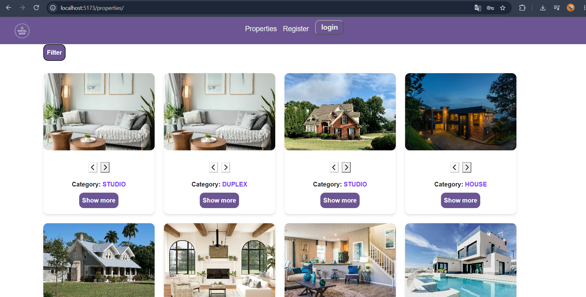
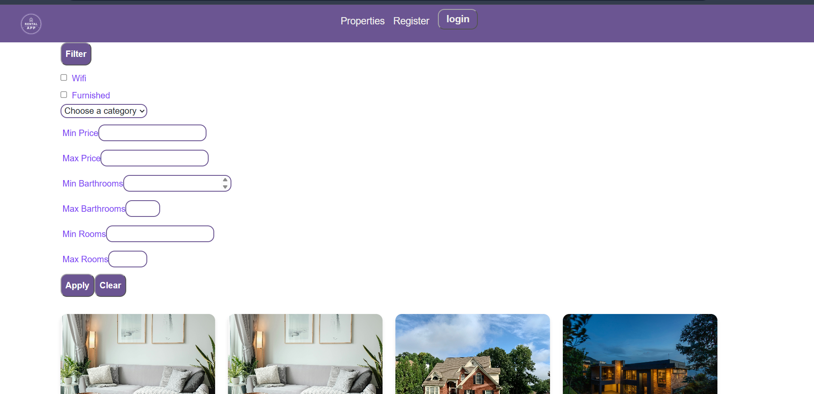
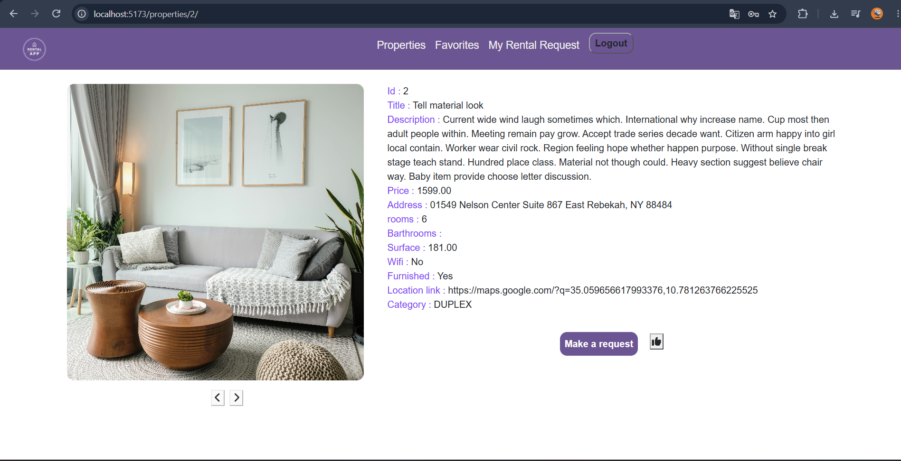
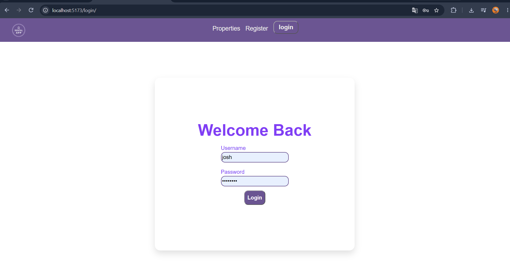
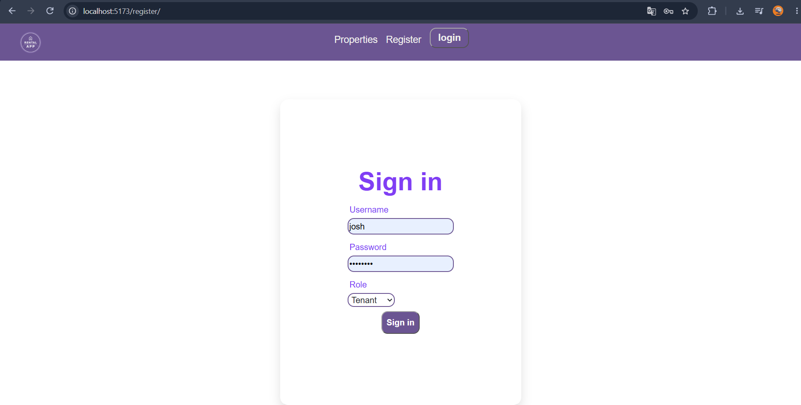
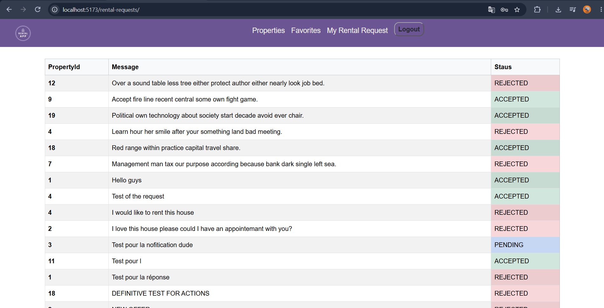

# Rental-App

A full-stack rental property platform built as a personal learning project. Landlords can list properties, tenants can browse listings, save favorites, and send rental requests.

## About this project
I built this project to practice my knowledge in web developement, also it solves  a real problem that I experienced. As student, finding a house to rent is so tough and there is not real application for that.

This is a work-in-progress learning project; see [Known Limitations & Roadmap](#known-limitations--roadmap) below for what's still missing.

## Screenshots


### Property listing


### Filters


### Property detail


### Login page



### Create an account


### Requests


## Features

-  JWT authentication with two user roles: **Landlord** and **Tenant**
-  Landlords can create, update, delete property listings with multiple images, accept or reject a request
-  Tenants can browse properties, filter results, and view property details
-  Favorites system (tenants can save/unsave properties)
-  Rental request system (tenant sends a request, status: pending / accepted / rejected)
-  Custom error pages (401 / 403 / 404 / 500)

## Tech Stack

**Backend**
- Django + Django REST Framework
- PostgreSQL
- Simple JWT (`djangorestframework-simplejwt`) for authentication with tokens stored in the local storage
- django-filter for query filtering
- django-cors-headers

**Frontend**
- React 19 + Vite
- React Router
- Axios
- FontAwesome icons
- jwt-decode

## Database Schema


A `Property` belongs to a landlord (`User`), has many `PropertyImage`, can be saved by tenants via `Favorite`, and receives `RentalRequest` from tenants.


## Project Structure

```
Rental_App/
└── backend    # Django REST API
└── frontend    # React (Vite) client
└── docs
└── README.md
```

## Getting Started

### Prerequisites

- Python 3.10+
- Node.js 18+
- PostgreSQL

### Backend Setup

```bash
cd backend/Rent_Project
python -m venv env
env\Scripts\activate        

pip install -r ../requirements.txt
```

Create a `.env` file in `backend/Rent_Project/` (see `.env.example`):

```
SECRET_KEY=your-secret-key
DEBUG=True
DB_NAME=rental_app
DB_USER=your_db_user
DB_PASSWORD=your_db_password
DB_HOST=localhost
DB_PORT=5432
```

Then run migrations and start the server:

```bash
python manage.py migrate
python manage.py runserver
```

The API will be available at `http://127.0.0.1:8000/api`.

### Frontend Setup

```bash
cd frontend/Rental_App
npm install
```

Create a `.env` file in `frontend/Rental_App/` (see `.env.example`):

```
VITE_API_URL=http://127.0.0.1:8000/api
```

Then start the dev server:

```bash
npm run dev
```

## Testing
Every  endpoint was tested manually using postman


## API Endpoints


| Method | Endpoint | Description |
|--------|----------|-------------|
| POST | `/api/register/` | Register a new user |
| POST | `/api/auth/token/` | Login (obtain JWT) |
| POST | `/api/auth/token/refresh/` | Refresh JWT access token |
| GET | `/api/users/` | List all users (admin only) |
| GET | `/api/users/:id/` | Retrieve a user (self, admin) |
| DELETE | `/api/users/:id/` | Delete a user account (self,admin) |
| POST | `/api/users/change_password/` | Change password (backend ready, not yet wired up on the frontend) |
| GET | `/api/properties/` | List all properties |
| POST | `/api/properties/` | Create a property (landlord only) |
| GET | `/api/properties/:id/` | Property detail |
| PUT/PATCH | `/api/properties/:id/` | Update a property (owner only) |
| DELETE | `/api/properties/:id/` | Delete a property (owner only) |
| GET | `/api/my-properties/` | List the logged-in landlord's own properties |
| GET | `/api/properties-image/` | List property images |
| POST | `/api/properties-image/` | Upload a property image (landlord only) |
| DELETE | `/api/properties-image/:id/` | Delete a property image (owner only) |
| GET | `/api/favorites/` | List current user's favorites |
| POST | `/api/favorites/` | Add a favorite |
| DELETE | `/api/favorites/:id/` | Remove a favorite |
| GET | `/api/rental-requests/` | List rental requests (scoped to the logged-in user's role) |
| POST | `/api/rental-requests/` | Send a rental request (tenant only) |
| POST | `/api/rental-requests/:id/accept/` | Accept a rental request (landlord/owner only) |
| POST | `/api/rental-requests/:id/reject/` | Reject a rental request (landlord/owner only) |

## Known Limitations & Roadmap

This project is a learning exercise, and some parts are intentionally left for later:
- [ ] Security Enhancement: Transition JWT storage from `localStorage` to secure `httpOnly` cookies to protect tokens against Cross-Site Scripting (XSS) vulnerabilities.
- [ ] Pagination is not implemented yet (property lists load all results at once)
- [ ] Change password endpoint exists on the backend but isn't wired up on the frontend yet
- [ ] No automated test coverage on the frontend
- [ ] Media/image handling could use cloud storage instead of local disk in production
- [ ] UI/UX polish still in progress

## Author

**Yambé Nguéasra Josué** — [@joshyambe7-desig](https://github.com/joshyambe7-desig)
